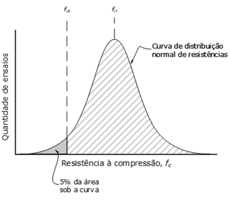

### Normas do Concreto Armado:
- ABNT NBR 6118 -> Projeto de Estruturas de Concreto - Procedimento
- ABNT NBR 5738 -> Moldagem de corpo de prova cilíndrico
- ABNT NBR 5739 -> Resistência à Compressão do Concreto
- ABNT NBR 7222 -> Ensaio para determinação da resistência à tração por compressão diametral
- ABNT NBR 12142 -> Ensaio para determinação da resistência à tração por flexão, para ruptura dentro e fora do terço médio do vão.
- ABNT NBR 8953 -> Concreto para fins estruturais, de acordo com critérios de resistência e de consistência.
- ABNT NBR 8522 -> Procedimento para determinação dos módulos de elasticidade tangente inicial e secante.
- ABNT NBR 12655 -> Resistência Característica à Pressçao (Fck)

### Normas do Aço: 
- ABNT NBR 7480

### Conceitos
- Gráfico: Distribuição Normal de Resistências à Compressão, de quantidade suficiente de corpos de prova.  
    
- Gráfico Tensão/Deformação do concreto
- Gráfico Tensão/Deformação do aço
- Resistência e consistência do concreto
- Classes do concreto:
    - C20 -> Resistência Característica À Compressão = 20MPa
    - C25 -> Resistência Característica À Compressão = 25MPa
    - C30 -> Resistência Característica À Compressão = 30MPa
    - C35 -> Resistência Característica À Compressão = 35MPa
    - C40 -> Resistência Característica À Compressão = 40MPa
    - C45 -> Resistência Característica À Compressão = 45MPa
    - C50 -> Resistência Característica À Compressão = 50MPa
    - Concreto de Alta Resistência:
        - C55 -> Resistência Característica À Compressão = 55MPa
        - C60 -> Resistência Característica À Compressão = 60MPa
        - C70 -> Resistência Característica À Compressão = 70MPa
        - C80 -> Resistência Característica À Compressão = 80MPa
        - C90 -> Resistência Característica À Compressão = 90MPa
        - C100 -> Resistência Característica À Compressão = 100MPa
- Propriedades do Aço
- Classes do Aço
    - CA 25  -> Resistência Característica Ao Escoamento = 250MPa
    - CA 50  -> Resistência Característica Ao Escoamento = 500MPa
    - CA 60  -> Resistência Característica Ao Escoamento = 600MPa