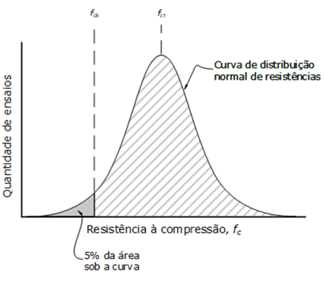

- Elementos:
    - concreto
    - aço
- Gráfico: Distribuição Normal de Resistências à Compressão, de quantidade suficiente de corpos de prova.  
    
- Gráfico Tensão/Deformação do concreto
- Gráfico Tensão/Deformação do aço
- Resistência e consistência do concreto