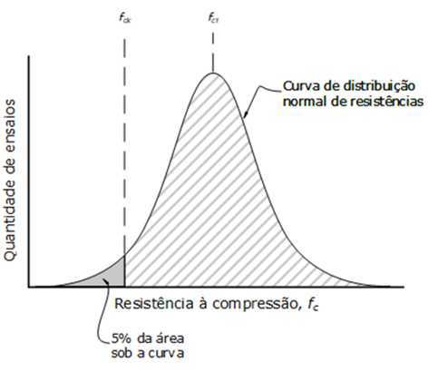

- Elementos constitutivos:
    - concreto
    - aço
- Classes do concreto
    - Normas de segurança relacionada aos estados limites
- Usado em elementos de construção:
    - Pilar
    - Viga
    - Verga
    - Contra-verga
    - Fundação
    - Laje
- Patologias no concreto:
    - Fissuras
    - Trincas
- Esforços (recebidos):
    - Solicitações Normais
    - Esforço gerador de flexão normal simples
    - Esforço cisalhante
- Deformações à partir do dimensionamento das seções das vigas.
- Características:
    - Resistência de aderência entre o concreto e o aço.
    - Comprimento de ancoragem. (quanto que a barra de aço deve entrar no concreto)
- Dimensionamento das estruturas de concreto
    - Normas de segurança relacionadas à segurança estrutural e a metodologia de dimensionamento nos estados limites.
- Idealização normativa dos domínios
- Gráfico: Distribuição Normal de Resistências à Compressão, de quantidade suficiente de corpos de prova.  
    
- Gráfico Tensão/Deformação do concreto
- Gráfico Tensão/Deformação do aço
- Resistência e consistência do concreto