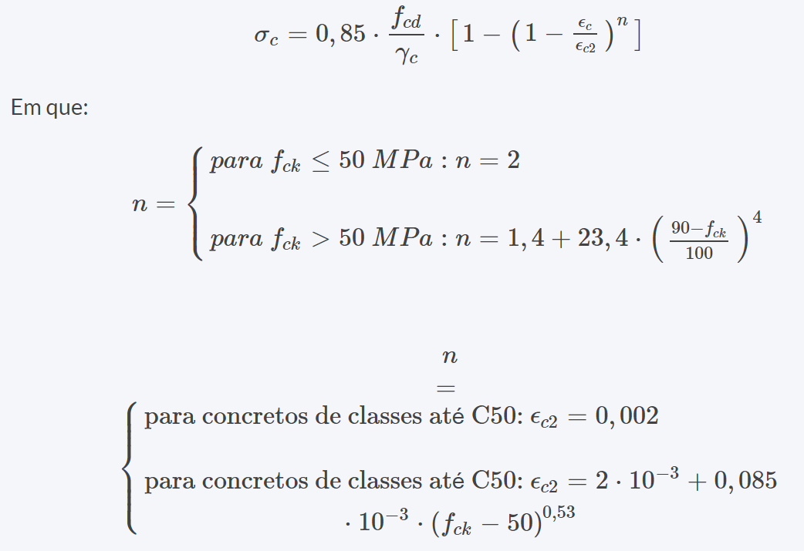
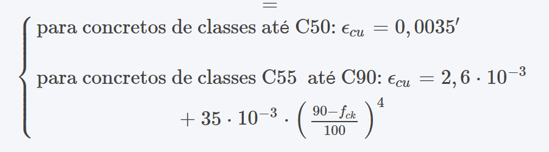
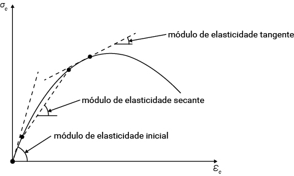

### Concreto
- Características:
    - Resistência característica à compressão (Fck)
        - Classes do concreto
    - Consistência
    - Resistência à Tração
    - Resistência à Tração por compressão diametral:
        - Fct,sp
    - Resistência à Tração na flexão:
        - Fct,f
    - Resistência à Tração Direta:
        - Fct
    - Resistência à Tração Direta (valor médio):
        - Fct,m
    - Resistência à Tração Direta Inferior:
        - Fctk,inf
    - Resistência à Tração Direta Superior:
        - Fctk,sup
    - Resistência XXXXX:
        - Fck

- Diagrama de Tensão-Deformação na compressão
    - Diagrama parábola-retângulo simplificado
    - Tensão de compressão máxima = 0,85 Fck
    - Ec2 = deformação correspondente à tensão máxima Fc
    - Ecu = deformação no instante de ruptura
    - Equação para a relação tensão-deformação, antes de alcançar deformação Ec2:
    
    - Fórmula para cálculo de Ecu:
    

- Módulos de Elasticidade do Concreto:  

- A ABNT NBR 6118 especifica o coeficiente de Poisson ν e o módulo de elasticidade transversal Gc para tensões de compressão inferiores a 0,5 fc e tensões de tração inferiores a fct. 

- Quando se conhece a massa específica do concreto simples, a ABNT NBR 6118 recomenda que a massa específica do concreto armado (concreto simples + aço) seja determinada somando-se à massa específica do concreto simples um valor de 100 kg/m3 a 150 kg/m3.

- Deformação devido fluência
    - Achatamento irreversível do volume devido carregamentos permanentes.
- Deformação devido retração
    - Diminuição do volume devido perda de água da pasta de cimento.

