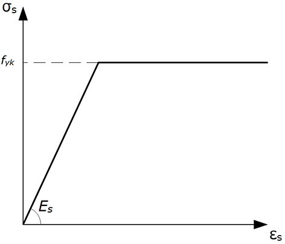

### Aço
- Tensão de resistência ao escoamento (Fyk)

- Classes do Aço

- Segundo a ABNT NBR 6118, a massa específica do aço pode ser adotada como 7850 kg/m3.

- Diagrama tensão-deformação simplificado
    - Obtido a partir de ensaios de tração especificados pela ANBT NBR ISO 6892-1. Na falta de ensaios para obtenção do módulo de elasticidade (Es), a ABNT NBR 6118 permite que seja adotado o diagrama tensão-deformação simplificado para aços com patamar de escoamento definido.
    

A ABNT NBR 6118 permite que o módulo de elasticidade do aço seja adotado como 210 GPa.

O aço utilizado em concreto armado deve atender aos requisitos de aderência ao concreto definidos pela ABNT NBR 6118 e aos requisitos de ductilidade definidos pelas normas ABNT NBR 7482, ABNT NBR 7483 e ABNT NBR 6004.
